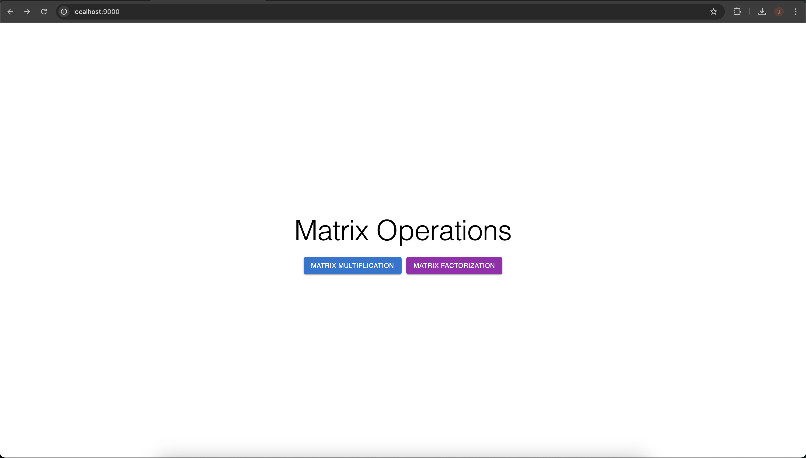
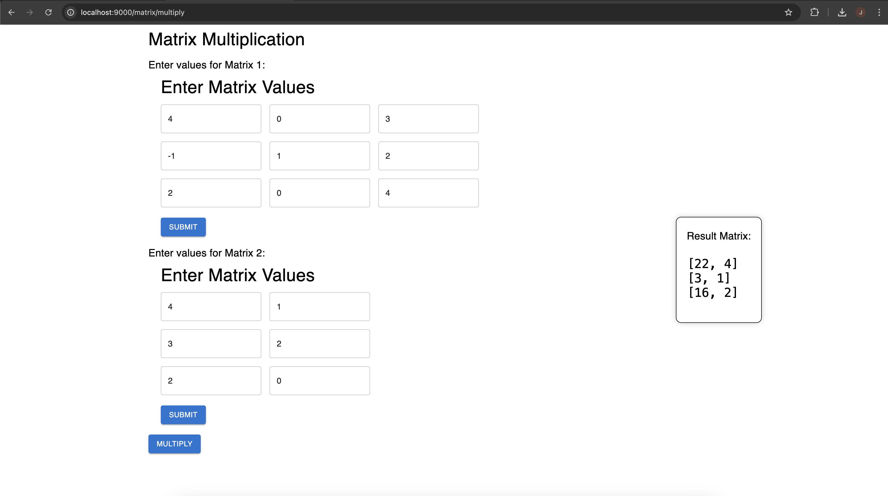
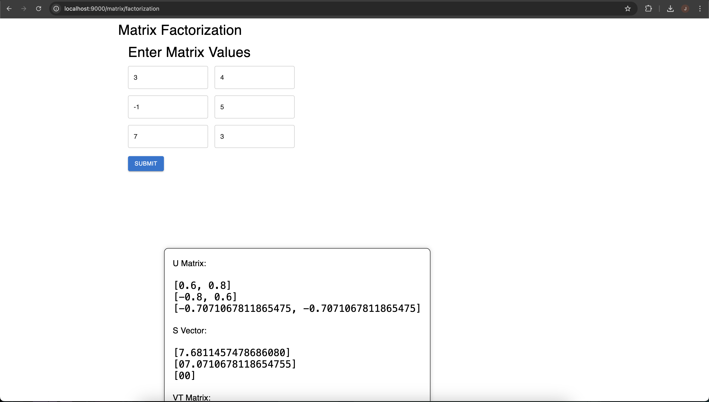

# Linear Algebra Project: Matrix Operations

Simple frontend to multiply and factorize matrixes. 

## Web Stack
- Frontend: React with Typescript
- Backend: Python, using FastAPI as Web framework


## Steps
1. Install all the dependencies 
- For TS:
```sh
npm i 
```
- For Python
```sh
pip install -r requirements.txt
```

2. Run the project
- Backend
```sh
cd src
python backend.py
```

- Frontend
```sh
npm start
```


## Display
I'm not that good making Frontend, okay? 😵‍💫

### Home Page


### Multiplying Matrixes



### Factorizing Matrixes
